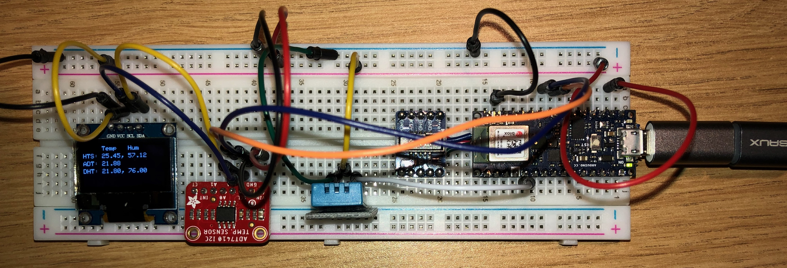

# Environment Sensor Tests

This is a very simple sketch that compares the temperature (and humidity when available)
between the HTS-221 sensor built into the Arduino Nano 33 BLE Sense, a DHT-11, and an
ADT7410 temperature sensor.

The project also includes an SSD1306 128x64 OLED display which shows the current values.

The KiCAD folder includes a simple schematic showing the hookup of the circuit.

[Schematic (PDF)](assets/EnvironmentSensorTests.pdf)

## DHT11 Sensor usage on a Nano 33 BLE Sense

The AdaFruit [DHT-Sensor-Library](https://github.com/adafruit/DHT-sensor-library) and
the [SimpleDHT](https://github.com/winlinvip/SimpleDHT) libraries for the DHT11 sensor
do not work out of the box on the Nano 33 BLE Sense.

The AdaFruit library uses microsecondsToClockCycles() which is available on most Arduino
boards but not the Nano 33 BLE boards.  (See issue [101](https://github.com/arduino/ArduinoCore-nRF528x-mbedos/issues/101) for more details.)  As a workaround I've included
the definition for microsecondsToClockCycles() in DHT.h and placed guards around it to
only apply for the Nano 33 BLE board and also incase it's defined for the board in the
standard library in the future.

A suggestion was made in issue 101 to use the micros() function to time the pulses.  However,
by default the Nano 33 BLE board uses the low frequency / low power ticker for the micros()
function.  While this is good from a power savings perspective it means that the precision
of the micros() function is 30.517 uS.  This is not precise enough to measure the pulses from
the DHT11 which may be as short as 16 uS.

As an alternative to using micros the Timer object is available in mbed OS.  The Timer has
microsecond precision on the NRF52840 chip.  Note, use of the Timer will prevent the board
from entering low power mode, this is probably why this timer is not used as the default
for the micros() function.  A very simply example is included using mbed pin definitions
and the Timer class.  Note, the example is missing many of the safety features and checks
that are available in the AdaFruit library.  I do not recommend using the code for production
use with out adding further safe guards.
